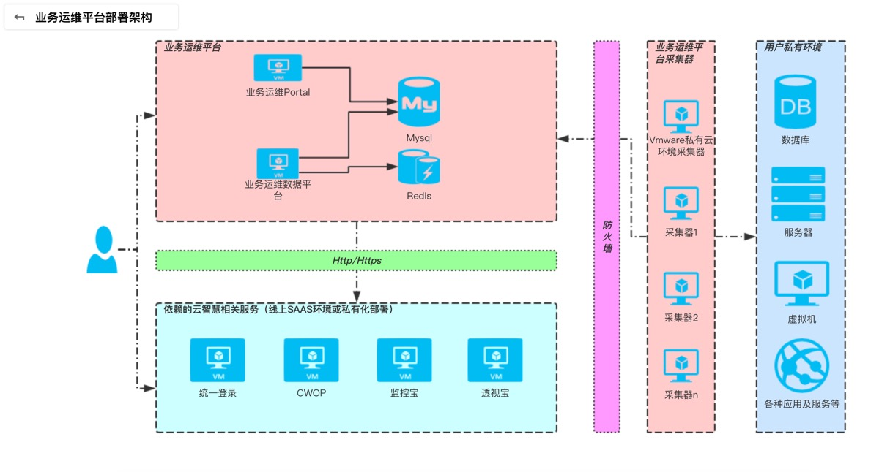

# SAPNetworkMonitor

## 架构



# SAPNetworkMonitor Server

## 编译 

```shell
git clone git@github.com:CloudWise-OpenSource/SAPNetworkMonitor.git

cd server

mvn clean install -Dmaven.test.skip=true 
```

```shell
.....
[INFO] --- maven-assembly-plugin:2.5.5:single (make-assembly) @ sap-network-monitor-server ---
[INFO] Reading assembly descriptor: src/main/assembly/assembly.xml
[INFO] Building tar: SAPNetworkMonitor/server/target/sap-network-monitor-server-1.0.0-bin.tar.gz
```

## 安装

#### 安装环境

​	*Java SE Runtime Environment 8* 

​	*MySQL* 

#### 安装步骤

##### 步骤 1

​	创建MySQL数据库:

```sql
CREATE DATABASE niping_db DEFAULT CHARACTER SET UTF8 COLLATE UTF8_GENERAL_CI;
```

##### 步骤 2

sap-network-monitor-server-1.0.0-bin.tar.gz可以按照编译步骤自己编译，也可以直接到
[SAPNetworkMonitor](https://github.com/CloudWise-OpenSource/SAPNetworkMonitor/releases)
处下载。

```Sh
tar -zxvf server/target/sap-network-monitor-server-1.0.0-bin.tar.gz
```

##### 步骤 3

修改MySQL连接配置文件 *sap-network-monitor-server-1.0.0/conf/server.yml*

```yaml
database:
  driverClass: com.mysql.jdbc.Driver
  url: 'jdbc:mysql://localhost:3306/niping_db?useUnicode=true&characterEncoding=utf8&connectionCollation=utf8_general_ci'
  user: root
  password: 'root'
```

##### 步骤 4

初始化 MySQL 数据库表以及数据:

```bash
cd /sap-network-monitor-server-1.0.0/bin
./start.sh migrate
```

启动 server:

```shell
./start.sh
```

##### 步骤 5 

可以打开浏览器访问http://localhost:8080访问SAP network monitor server.

默认用户名：admin 密码sap118

##### 步骤 6

登录成功后安装 http://localhost:8080/api/install 的步骤安装SAP network monitor.


# SAPNetworkMonitor Monitor

Based on niping for sap network monitoring

This monitor is used to monitor network performance in each SAP-Agent by sending heartbeat to get monitoring task from SAP-Server and it supports Windows and Linux.

For convenience, users can set this monitor as Windows and Linux service.

There are compiled Apps in the project.Users should modify the config.ini according to the actual case and the config.ini should be put in the same directory as the App.

The monitor will make a file which contains the agent's monitorid as the program running, the path of this file is the operating system's home path,for example C:\Users\xxx.

## 1.How to Run it   

main.exe

## 2.How to Set it as Service   

install the  service        main.exe install   

Start the service           main.exe start   

Stop the service            main.exe stop   

Uninstall the service       main.exe uninstall
