1. # SAPNetworkMonitor

   > 欢迎大家加入官方QQ群（651878914）或者在 [Issues页面](https://github.com/CloudWise-OpenSource/SAPNetworkMonitor/issues)及时反馈问题，帮助我们改进SAP Network Monitor。

   ## 架构

   **Sap Network Monitor** 工具分为**Server**和**Monitor**两个部分.

   **Server**主要负责Monitor的监控和数据收集、统计、展现，它是一个Web服务，以直观简介的界面，让管理人员进行监控和快速的定位问题。它只需要部署一台就可以了，推荐部署在Linux系统上，数据库推荐使用PostgreSQL,也可以用Mysql

   **Monitor**实际上是代替SAP管理人员，在SAP的客户端机器或网络内执行niping命令，来对目标路由进行时延、稳定性、超时等测试，它与Server按频率进行心跳，并从Server端接收任务指令，在本地执行任务并返回结果。它可以安装在多个需要进行niping -c 监测的SAP客户机上。Monitor用Golang语言编写，并编译成了可执行程序，目前支持Windows、Linux系统，推荐安装成系统服务，这样它能够自动随机运行，并随时执行监测任务。

   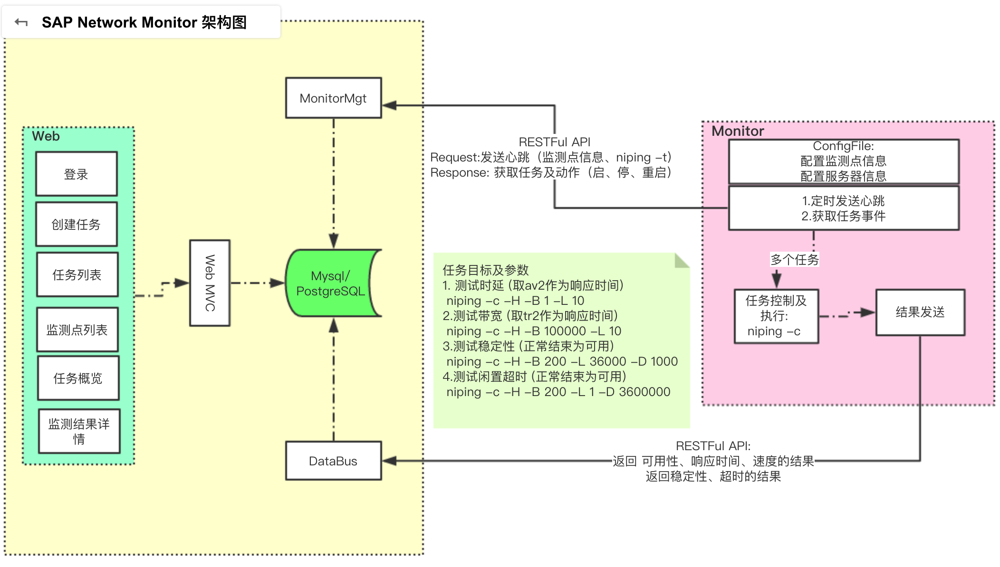

   # SAPNetworkMonitor Server

   ## 编译

   #### 编译环境

   ​	*Java SE Development Kit 8* 

   ​	*Maven* 

   #### 编译步骤

   ```shell
   git clone --depth=1 git@github.com:CloudWise-OpenSource/SAPNetworkMonitor.git

   cd server

   mvn clean install -Dmaven.test.skip=true 
   ```

   ```shell
   .....
   [INFO] --- maven-assembly-plugin:2.5.5:single (make-assembly) @ sap-network-monitor-server ---
   [INFO] Reading assembly descriptor: src/main/assembly/assembly.xml
   [INFO] Building tar: SAPNetworkMonitor/server/target/sap-network-monitor-server-1.0.0-bin.tar.gz
   ```

   ​

   ## 安装

   #### 安装环境

   ​	*Java SE Runtime Environment 8* 

   ​	*MySQL* (推荐5.6)

   #### 安装步骤(linux)

   ##### 步骤 1

   创建MySQL数据库

   ```sql
   CREATE DATABASE niping_db DEFAULT CHARACTER SET UTF8 COLLATE UTF8_GENERAL_CI;
   ```

   ##### 步骤 2

   sap-network-monitor-server-1.0.0-bin.tar.gz可以按照编译步骤自己编译，也可以直接到[SAPNetworkMonitor](https://github.com/CloudWise-OpenSource/SAPNetworkMonitor/releases)下载。

   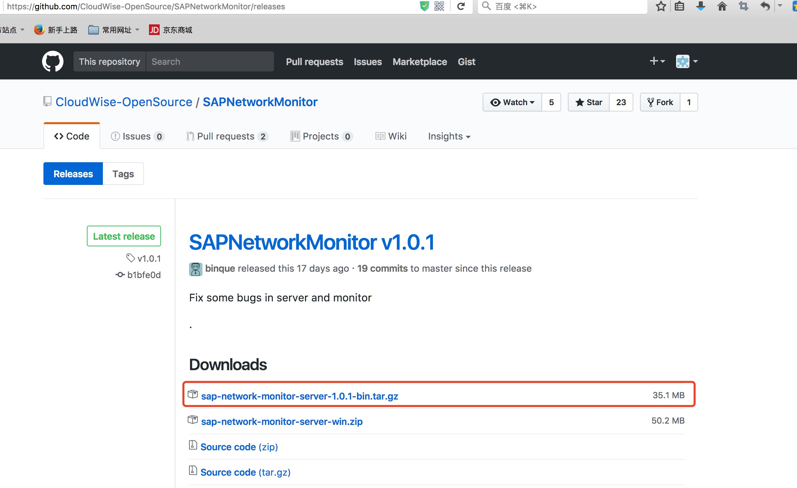

   ```Sh
   tar -zxvf server/target/sap-network-monitor-server-1.0.0-bin.tar.gz
   ```

   ##### 步骤 3

   修改MySQL连接配置文件 *sap-network-monitor-server-1.0.0/conf/server.yml*

      这里主要修改user及password

   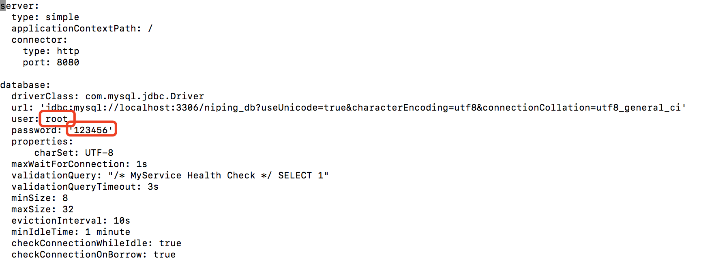

   ##### 步骤 4

   初始化 MySQL 数据库表以及数据:

   ```bash
   cd /sap-network-monitor-server-1.0.0/bin
   ./start.sh migrate
   ```

   启动 server:

   ```shell
   ./start.sh
   ```

   ##### 步骤 5

   可以打开浏览器(推荐使用Google浏览器)访问http://localhost:8080访问SAP network monitor server.

   默认用户名：admin 密码sap118

   ​            此处再次强调浏览器选择尽量选用Google浏览器

   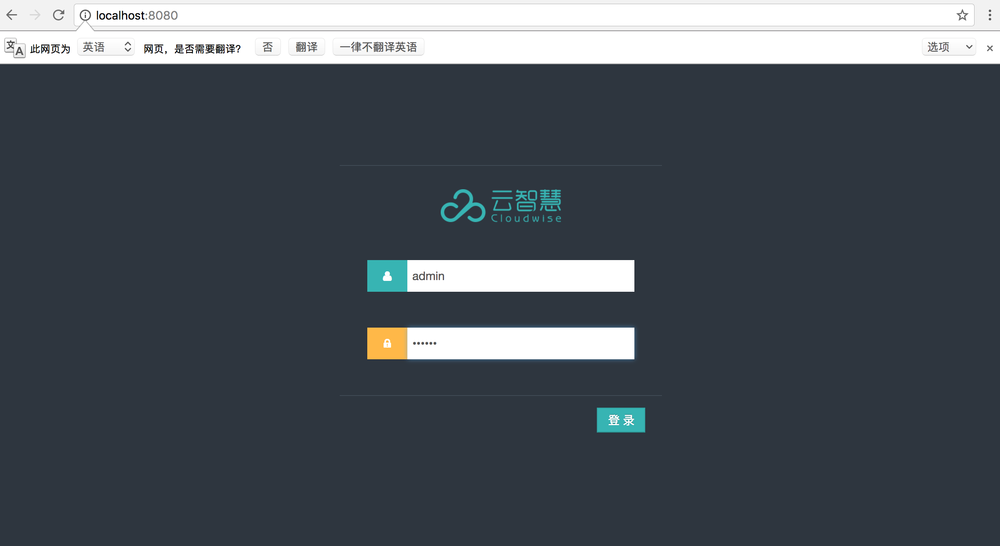

   ##### 步骤 6

   登录成功后安装 http://localhost:8080/api/install 的步骤安装SAP network monitor.

   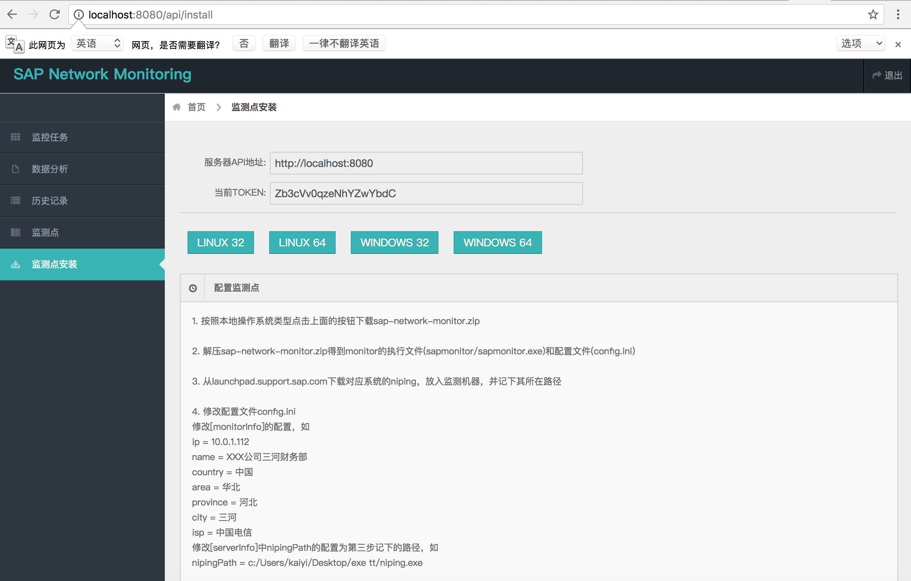

   #### 安装步骤(windows)

   ##### 步骤 1

   创建MySQL数据库

   ```sql
   CREATE DATABASE niping_db DEFAULT CHARACTER SET UTF8 COLLATE UTF8_GENERAL_CI;
   ```

   ##### 步骤 2

     1.安装JRE

     2.设置Java系统环境变量（具体步骤如下）

   在控制面板\系统\高级系统设置\高级\环境变量\系统变量 设置java_home(**注意java_home请全部小写，变量值中的java版本以自己的版本为准**)

   ```
   变量名  java_home
   变量值  C:\Program Files\Java\jdk1.8.0_131
   ```

   将`%java_home%\bin;`加入到系统Path变量中去

   启动cmd，输入java确认得到正确的输出：

   ```shell
   C:\Users\Administrator>java
   用法: java [-options] class [args...]
              (执行类)
      或  java [-options] -jar jarfile [args...]
              (执行 jar 文件)
              ......
   ```

   ##### 步骤 3

   在[SAPNetworkMonitor](https://github.com/CloudWise-OpenSource/SAPNetworkMonitor/releases)下载sap-network-monitor-server-win.zip。

   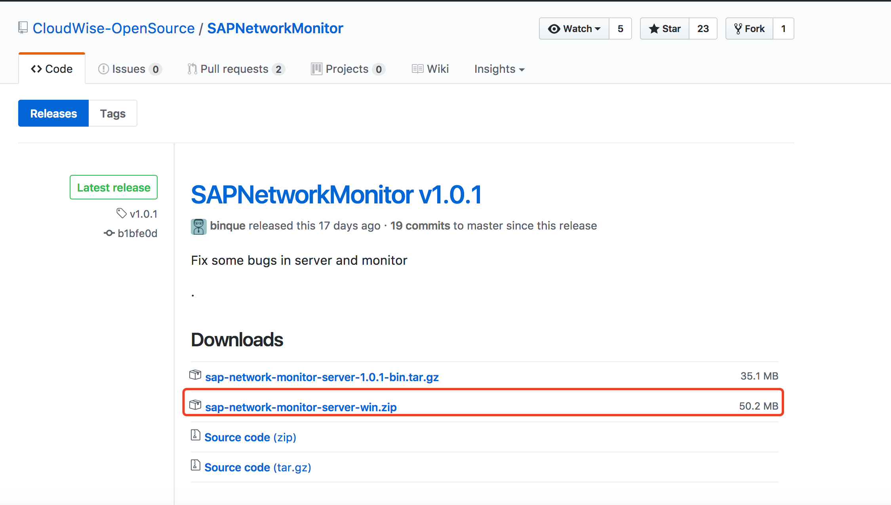

   ```Sh
   unzip sap-network-monitor-server-win.zip
   ```

   ##### 步骤 3

   修改MySQL连接配置文件 *sap-network-monitor-server-win/conf/server.yml*  

      这里主要修改user及password

   

   ##### 步骤 4

   通过windows的cmd找到bat执行目录(这里是绝对路径)

   ```
   cd c:\Users\zona\DeskTop\sap-network-monitor-server-win\bat
   ```

   初始化 MySQL 数据库表以及数据

   ```Sh
   startSAP.bat migrate
   ```

   数据库初始化完成之后，你可以在console直接启动server或者将server安装成服务再启动

   前端启动server

   ```
   startSAP.bat
   ```

   或者

   ```
   runConsole.bat
   ```

   安装服务

   ```
   installService.bat
   ```

   启动服务

   ```
   startService.bat
   ```

   停止服务

   ```
   stopService.bat
   ```

   卸载服务

   ```
   uninstallService.bat
   ```

   ##### 步骤 5

   可以打开浏览器(推荐使用Google浏览器)访问http://localhost:8080访问SAP network monitor server.

   默认用户名：admin 密码sap118

   ​       此处再次强调浏览器选择尽量选用Google浏览器

   

   ##### 步骤 6

   登录成功后在 “监测点安装” 按照 “配置监测点”的步骤安装SAP network monitor.

   

   ## 使用说明

   1. Monitor安装并启动后，过几分钟，应该可以在Server的监测点菜单中看到，如果没有，可以通过查看Monitor安装目录中的log日志来定位问题。

      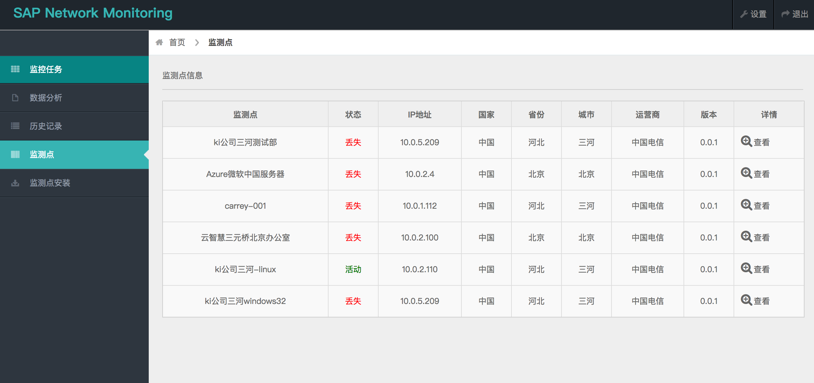

   2. 如果Server的监测点菜单中可以看到安装的Monitor,说明Monitor与Server的通讯正常，此时，管理人员可以在Server上查看当前Monitor上执行niping -t的结果（点击“监测点”菜单中监测点最右侧的查看按钮）

      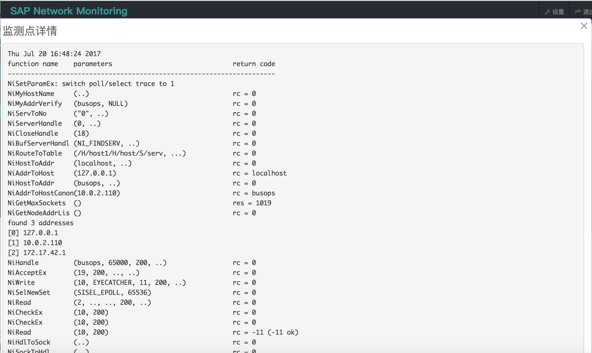

   3. 管理人员可以在Server上创建一个任务，指定SAP路由，并选中由哪几个Monitor来执行niping -c 的监测。

      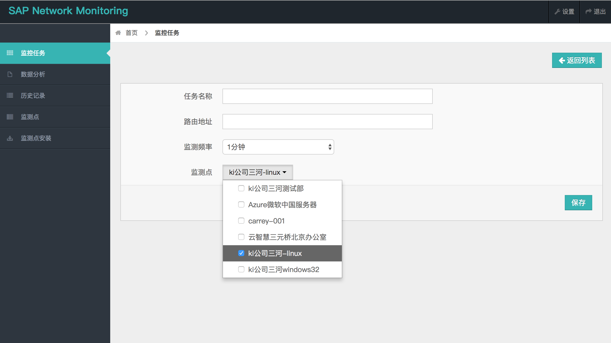

   4. 任务创建成功后，过几分钟，Monitor会接收到任务指令，按设定的频率开始对路由进行监测，并持续将结果返回给Server.

   5. Server端可以通过数据分析和历史记录来查看任务和Monitor执行的结果。

      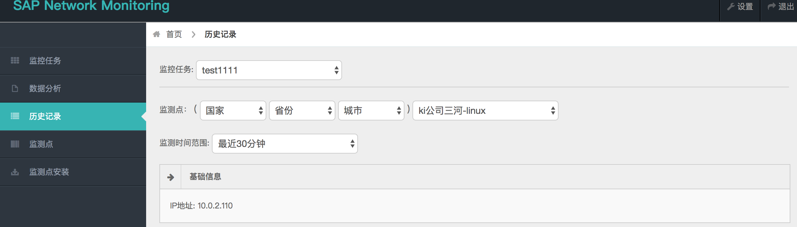

   6. 如果某个Monitor在某次执行失败，会在监测历史中显示为不可用，这时管理人员可以在Server上查看其niping 执行出错后的errmsg（点击监测历史中不可用旁边的小按钮）.

   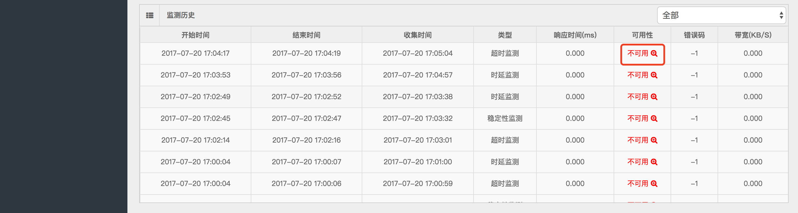
